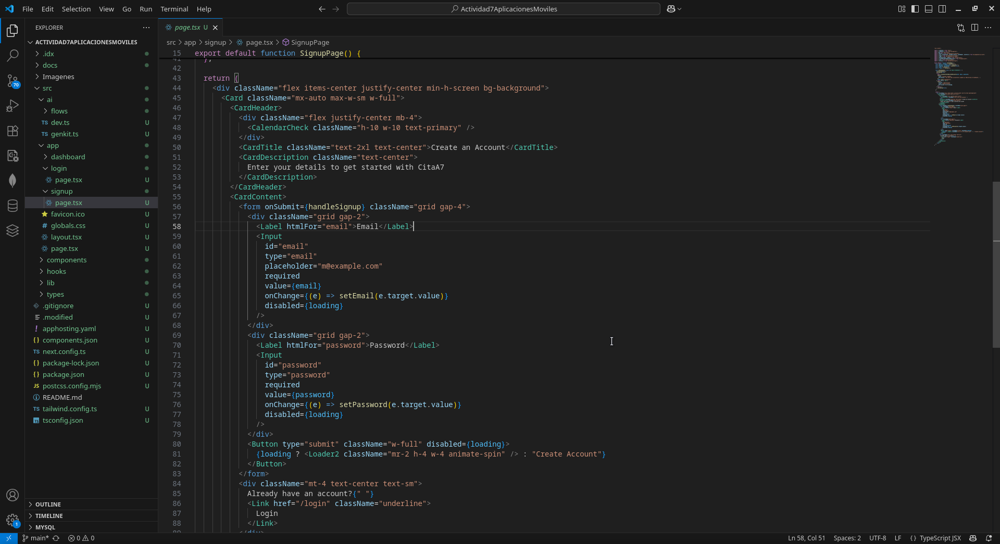
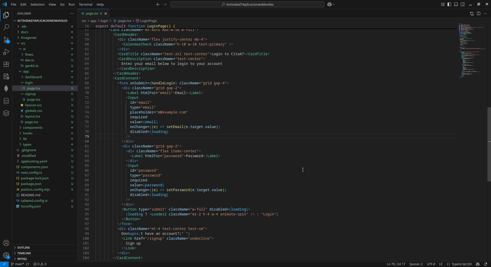
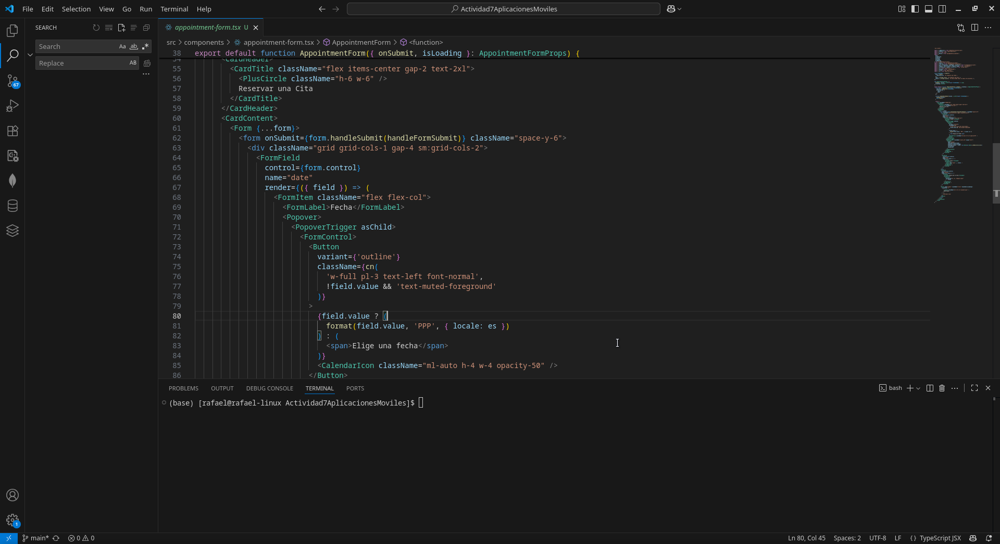
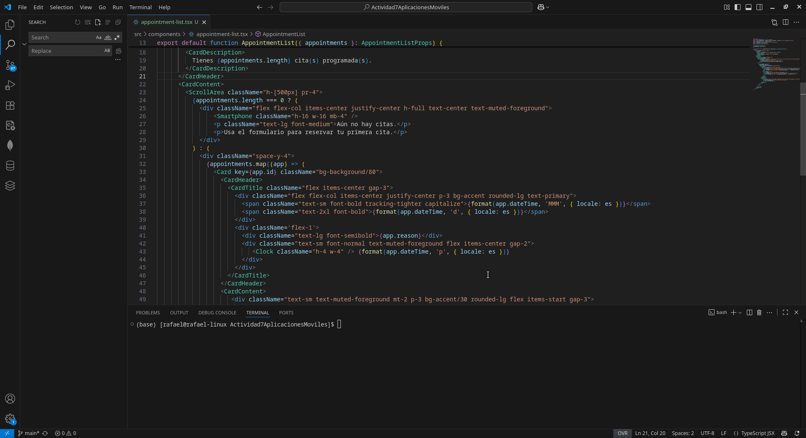
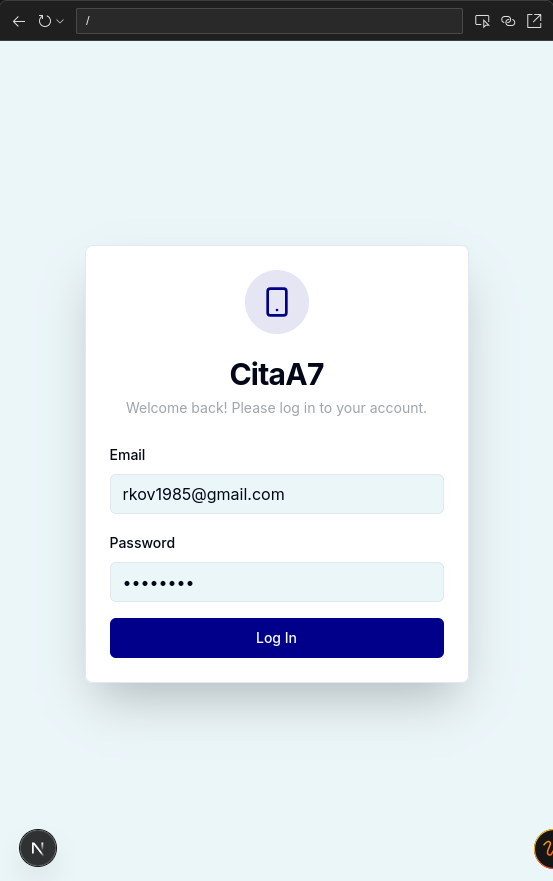
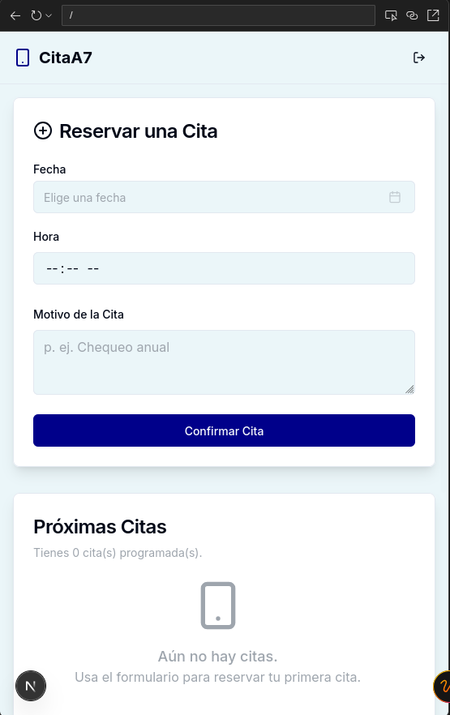

# Actividad 6 - Aplicaciones Móviles

## Sistema de Reservas de Citas con Notificaciones
Aplicacion donde se puede iniciar sesion con una cuenta, realizar una cita y se le enviara una notificacion 15 minutos antes de que la cita empiece, y cuenta con un historial de citas realizadas por el usuario
---
## 1. Vista de inicio de sesion

## 2. Vista de lista de registrar cuenta

## 3. Vista de formulario de creacion de nueva cita

## 4. Vista del historial de las citas reservadas

## 5. Inicio de sesion en la aplicacion

## 6. Reservar cita

## 7. Historial de citas reservadas

**Autor:** Rafael Kadir Oporto Valencia